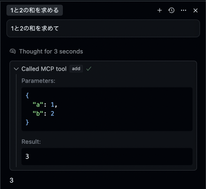
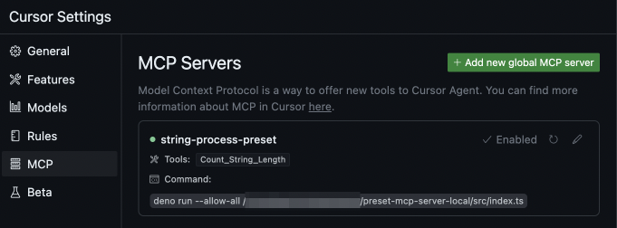
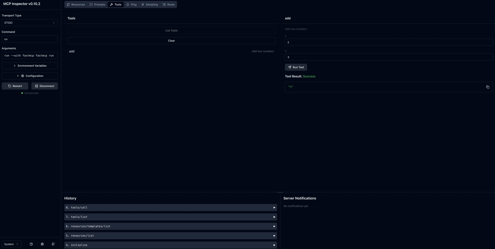

 


[](https://codespaces.new/Yoshida24/preset-mcpserver-python)

# preset-mcpserver-python
> ref. [jlowin/fastmcp](https://github.com/jlowin/fastmcp)

ホストマシン上で動作するMCPサーバーを開発するテンプレートです。  
fastmcp + Pythonで開発します。



## コンセプト
- Pythonベースでの開発をサポートします。
- uvを使ってPythonの依存関係管理を効率化します。

## 前提

- Python: 3.12
- uv: 0.6.2
- Cursor: 0.48.7
- 言語: Python
- マシン: M4 Macbook Air

## クイックスタート
MCPサーバを使用するための手順を開発します。  
ここではサンプルとして用意した、文字列の長さを表示するMCPサーバーを使う手順を説明します。  
MCP ClientはCursorを使用します。

> [!NOTE]
> ここではCursorでの使い方を紹介しますが、各種MCPクライアントに以下と同様の定義をすることで同じように使うことが可能です。

必要な依存関係をインストールします：

```bash
uv sync
```

(optional)環境変数ファイルをコピーして設定します。

```bash
cp .env.tmpl .env
# .envを編集
```

> `.env` は開発用に使うファイルであり、設定しなくてもMCPから実行する際には動作に支障はありません。

開発環境を立ち上げます。

```bash
make dev
```

http://127.0.0.1:6274/ にアクセスできればOKです。

## Cursorで使う
Cursor > Preference > Cursor Settings > MCP を開き、以下の設定を追加します。  
`/path`は`main.py`の場所に応じて変更します。

```json
{
    "mcpServers": {
        "number-process-preset": {
            "command": "uvx",
            "args": [
                "fastmcp",
                "run",
                "/path/preset-mcpserver-python/src/main.py"
            ],
            "env": {
                "YOUR_ENV": "MyEnv"
            }
        }
    }
}
```

Cursor側でMCPサーバーが認識されればOKです。 MCPサーバが認識されると以下のように表示されます。



> [!WARNING]
> 認識されていない場合、依存性が解決されていない、pythonコマンドがCursorから実行できていない、などの不具合にぶつかっている可能性があるため、セットアップ手順をやり直してください。

Cursor Agent で「1と2の和を求めて」のように使用します。以下のようにMCPサーバの呼び出しが行われれば正常に動作しています。


# MCPサーバを開発するには
開発の際には `src/main.py` と `src/tools/` に機能を実装します。


> [!NOTE]
> 1Repositoryに対して1つのMCPサーバを実装し、1Repositoryに対して複数のMCPサーバを実装する実装は避けます。  
> MCP Serverを機能のグループ単位で1リポジトリとする理由は、MCPクライアント側でMCP serverのオプトイン/オプトアウトを制御しやすいようにするためです。MCPサーバ側で多くの機能を提供してしまうと、Agentがツール選択を間違う可能性が高くなってしまいます。このため本当に使用するツールだけをMCPクライアントに設定できるよう、オプトアウト可能な実装を行います。  
> 開発の際にはオプトアウトする単位でサーバーを分けられるような実装をしておくと便利であるため、1Repositoryに対して1つのMCPサーバを実装します。

## デバッグ
`make dev` でMCP InspectorのWeb UIを立ち上げ、toolごとに入力値を与えて出力を検査することができます。



## 関連情報

### uvによるPython環境のセットアップ
uvをインストールして依存関係管理を行います：

```bash
curl -LsSf https://astral.sh/uv/install.sh | sh
echo 'eval "$(uv generate-shell-completion zsh)"' >> ~/.zshrc
```

Python 3.12を指定します：

```bash
uv python pin 3.12
```

### 環境変数の設定
環境変数を設定するには以下のコマンドを使います：

```bash
set -a && source ./.env && set +a
```
